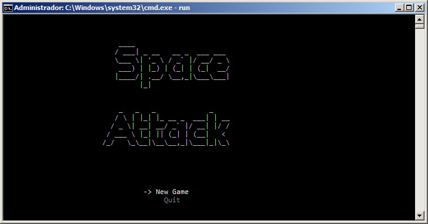
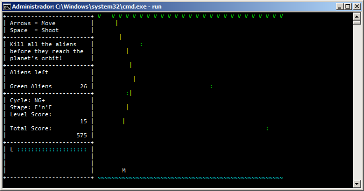
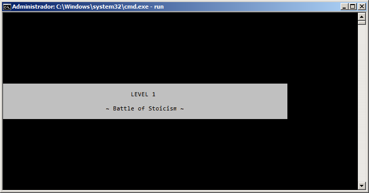
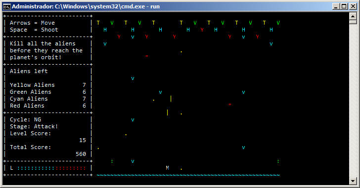

# Space Attack

This is *Space Attack*, a small game with mechanics similar to the famous *Space Invader*. Basically, shoot everything and try to stay alive.
My reason to create this game was to learn a bit of JNA and, mainly,  try to use Entity-Component Systems (ECS) in practice, using the approach on [T-Machine's famous blog posts](http://entity-systems.wikidot.com/rdbms-with-code-in-systems).

While the implementation used was naive, it was good enough for a game with zero graphics. I did this to force myself to create a "complete" game using ECS and see how it goes compared to more traditional approaches. While I did achieve the objective of completing the game, I ended up feeling ECS wasn't really that helpful. IMHO, the complications on component communication detract too much from this pattern, besides the whole "logic" of an entity ends up scattered everywhere.

Personally, I feel much better using [composition and aggregation](http://gameprogrammingpatterns.com/component.html).

# Screenshots

# How to run?

    gradle scripts
    run.sh # (or run.bat, if you're on Windows)

# License

BSD-3. Have fun. I'd probably won't change the code anytime soon, since the experiment is over.

Dedicated to my soon-to-be-born dauther, R.
